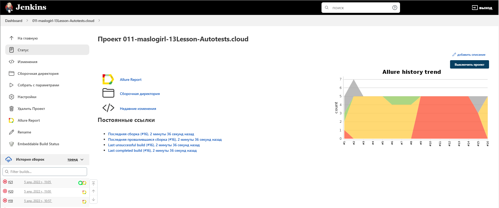
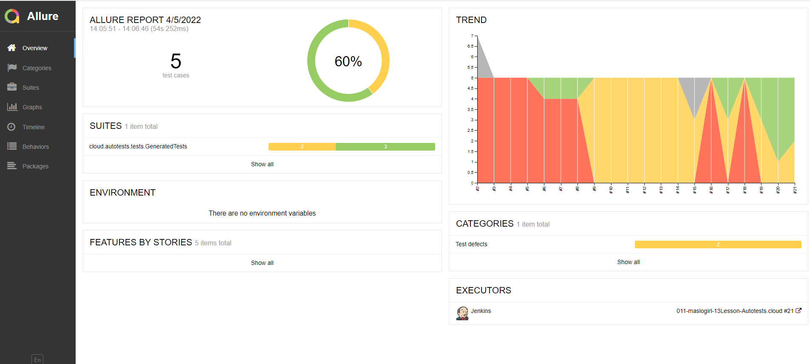
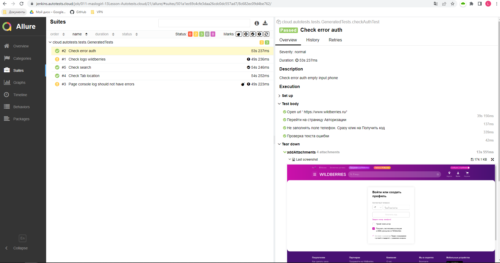
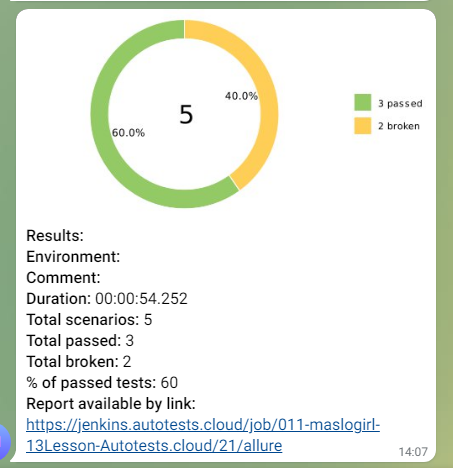

# Проект по автоматизации тестирования для wildberries
<a target="_blank" href="https://www.wildberries.ru//">Веб сайт wildberries</a>

## :drop_of_blood: Содержание:

- [Реализованные проверки](#boom-Реализованные-проверки)
- [Технологии](#classical_building-Технологии)
- [Сборка в Jenkins](#tests-launch-Jenkins)
- [Запуск из терминала](#earth_africa2-Запуск-тестов-из-терминала)
- [Allure отчет](#earth_africa-Allure-отчет)
- [Отчет в Telegram](#earth_africa3-Уведомление-в-Telegram-при-помощи-бота)


## :boom: Реализованные проверки

- ✓ Проверка логотипа
- ✓ Проверка функции поиска по тексту
- ✓ Проверка текста ошибки на странице авторизации/регистрации
- ✓ Проверка страницы Адреса
- ✓ Проверка ошибок в логах браузера


## :classical_building: Технологии

<p align="center">


</p>


##  </a> Jenkins <a target="_blank" href="https://jenkins.autotests.cloud/job/011-maslogirl-13Lesson-Autotests.cloud//"> job </a>
<p align="center">
<a href="https://jenkins.autotests.cloud/job/011-maslogirl-13Lesson-Autotests.cloud//"></a>
</p>


### :maple_leaf: Параметры сборки в Jenkins:

- REPOSITORY  (репозиторий для сборки)
- BROWSER (браузер, по умолчанию chrome)
- BROWSER_VERSION (версия браузера, по умолчанию 100.0)
- BROWSER_SIZE (размер окна браузера, по умолчанию 1920x1080)
- REMOTE_DRIVER_URL (логин, пароль и адрес удаленного сервера selenoid)
- THREADS (количество потоков для запуска тестов, по умолчанию 5)
- BRANCH ( ветка для запуска, не изменять необходимое значение wildberries)

## :earth_africa2: Запуск тестов из терминала

Локальный запуск:
```
gradle clean test
```

Удаленный запуск:
```
clean
test
-Dbrowser=${BROWSER}
-DbrowserVersion=${BROWSER_VERSION}
-DbrowserSize=${BROWSER_SIZE}
-DbrowserMobileView="${BROWSER_MOBILE}"
-DremoteDriverUrl=https://user1:1234@${REMOTE_DRIVER_URL}/wd/hub/
-DvideoStorage=https://${REMOTE_DRIVER_URL}/video/
-Dthreads=${THREADS}
```

## :earth_africa: Allure-отчет
</a> Отчет в <a target="_blank" href="https://jenkins.autotests.cloud/job/011-maslogirl-13Lesson-Autotests.cloud/21/allure/#suites/501a1ec69c4cfe3daa26cdc0dc557ad7/8c682ec09d4be762/">Allure report</a>
<p align="center">
<a href="https://jenkins.autotests.cloud/job/011-maslogirl-13Lesson-Autotests.cloud/21/allure/#suites/501a1ec69c4cfe3daa26cdc0dc557ad7/8c682ec09d4be762/"></a>
</p>
<p align="center">
<a href="https://jenkins.autotests.cloud/job/011-maslogirl-13Lesson-Autotests.cloud/21/allure/#suites/501a1ec69c4cfe3daa26cdc0dc557ad7/8c682ec09d4be762/"></a>
</p>


## :earth_africa3: Уведомление-в-Telegram-при-помощи-бота
</a>
<p align="center">
</a>
</p>


